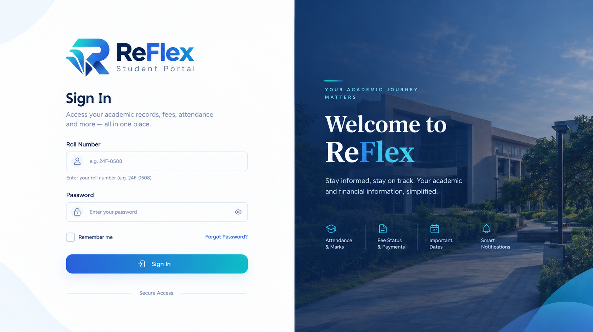
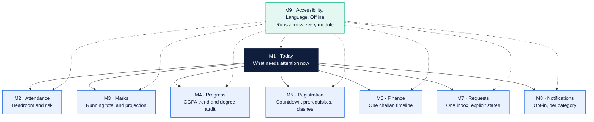
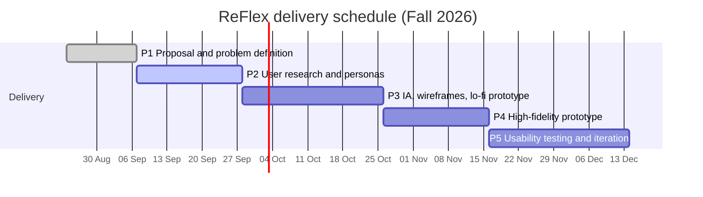

<div align="center">


### A redesigned student portal for university academic management

**Flex shows you rows. ReFlex tells you what they mean.**

<br />

[](docs/PROJECT_CHARTER.md)
[](https://www.nu.edu.pk/)
[](CONTRIBUTING.md)
[](LICENSE)

[](#-project-phases)
[](#-tech-stack)
[](docs/ACCESSIBILITY.md)
[](docs/DATA_AND_PRIVACY.md)
[](docs/ACCESSIBILITY.md)

</div>

---

## 🎯 What this is

ReFlex is a **responsive web portal** that keeps every record the university's existing portal already holds and adds the interpretation that is missing.

The existing system, Flex, is a read-only record viewer. Every screen is a table and a semester selector. It performs no computation and issues no notification, so a student must do the arithmetic, remember the calendar and poll the site by hand. The consequences are academic and financial: an attendance threshold breached, a fee deadline missed.

ReFlex inverts that relationship. **The derived answer leads. The raw record stays one tap behind.**

<div align="center">

| Flex asks you to work it out | ReFlex tells you |
| :--- | :--- |
| A lecture-by-lecture attendance log and a percentage bar | *"You can miss 3 more classes in CS3001 before dropping below 80%"* |
| A list of published marks | *"You need 84% in the final to reach an A"* |
| One challan row beside forty lines of bank instructions | *"Rs 194,500 due in 4 days"* |
| A red banner reading "Registration not active yet" | *"Registration opens in 6 days. Build your draft schedule now."* |
| Course status encoded in colour with no legend | A labelled chip, with the legend on the same screen |

</div>

---

## 🖼️ Screens

<div align="center">

<br /><em>Sign in</em>
</div>

<br />

> **Adding more screens:** drop image files into `docs/assets/screens/` and link them here.
> Suggested naming keeps them ordered: `02-dashboard.png`, `03-attendance.png`, `04-marks.png`, and so on.
> Table layout below is ready to fill in.

<div align="center">

| Today dashboard | Attendance intelligence |
| :---: | :---: |
| <!--  --> *coming in Phase 4* | <!--  --> *coming in Phase 4* |
| **Grade projection** | **Finance timeline** |
| <!--  --> *coming in Phase 4* | <!--  --> *coming in Phase 4* |

</div>

---

## 🧩 The nine modules



<div align="center">

| Module | What it does |
| :--- | :--- |
| **M1 · Today** | Replaces the profile dump. Next class, attendance risk, unpaid challan with days remaining, open registration window, marks published since the last visit. Identifiers masked by default. |
| **M2 · Attendance** | Leads with the headroom sentence. Per-course risk state, end-of-semester projection, lecture log one tap behind. |
| **M3 · Marks** | Weighted running total, explicit empty states naming who publishes what, and the score still needed for a target grade. |
| **M4 · Progress** | CGPA trend across semesters, credits earned against credits required, every status code a labelled chip beside a permanent legend. |
| **M5 · Registration** | Window dates and a countdown even while closed, prerequisite checking, clash detection, a draft schedule built before the window opens. |
| **M6 · Finance** | One chronological challan timeline. Payment instructions on request, not on every visit. |
| **M7 · Requests** | Feedback, retake, grade change and withdrawal in one inbox, each with an explicit state. |
| **M8 · Notifications** | Opt-in per category. This is what turns a viewer into a system. |
| **M9 · Cross-cutting** | WCAG 2.1 AA, no colour-only status, Urdu locale, offline reads labelled with their sync time. |

</div>

---

## 📐 Design principles

Five rules the project holds itself to. Every pull request is reviewed against them.

<div align="center">

| # | Principle | In practice |
| :---: | :--- | :--- |
| **1** | **Answer first, record second** | Every screen opens with the derived figure in one line. The underlying table is reachable, never the landing content. |
| **2** | **No screen stays silent** | Every screen has a designed empty, loading, error and offline state that names what is missing and who supplies it. |
| **3** | **Never colour alone** | Status carries a text label or an icon. Colour reinforces, it never encodes. |
| **4** | **Estimates are labelled** | Every derived figure says it is an estimate, states its assumptions, and links to the official record. |
| **5** | **Nothing is a dead end** | A closed window states when it opens. A failed action states what to do next. |

</div>

Full reasoning, with the Nielsen, Norman and WCAG references behind each rule, is in **[docs/DESIGN_PRINCIPLES.md](docs/DESIGN_PRINCIPLES.md)**.

---

## 🛠️ Tech stack

<div align="center">


</div>

- **Phase 3** wireframes and the first clickable walkthrough are built in **Figma**.
- **Phase 4** implements the prototype as a responsive single-page application in **React**, over a seeded JSON data set.
- Offline reads use the browser cache and a service worker. Charts use a JavaScript charting library.
- **No backend.** No university API, no real authentication, no payment processing. See [Scope](#-scope).

---

## 🚀 Getting started

```bash
git clone https://github.com/<org-or-user>/reflex-student-portal.git
cd reflex-student-portal

npm install
npm run dev        # start the dev server
npm run build      # production build
npm run lint       # lint and format check
npm run a11y       # automated accessibility audit
```

> Phase 3 is design-only, so the `src/` tree is a placeholder until Phase 4 begins.
> Until then the living artefacts are the Figma file and the documents under `docs/`.

---

## 🔒 Scope

<div align="center">

| ✅ In scope | ❌ Out of scope |
| :--- | :--- |
| All nine modules as an interactive high-fidelity prototype | Live integration with the university's Flex database or any university API |
| Realistic seeded data modelled on the shapes observed in the real portal | Real authentication against university credentials |
| Light and dark themes, English and Urdu locales | Actual payment processing through KuickPay, JazzCash, EasyPaisa or any bank |
| WCAG 2.1 AA conformance on every screen | Faculty, staff, registrar and administrator portals |
| Offline reads labelled with their synchronisation time | Timetable generation and room allocation |
| Usability testing with real undergraduates in Phase 5 | Any write path back to official university records |

</div>

**Every record in this repository is invented.** No real student data is stored, transmitted or displayed. See **[docs/DATA_AND_PRIVACY.md](docs/DATA_AND_PRIVACY.md)**.

---

## 📅 Project phases



<div align="center">

| Phase | Weeks | Deliverable | Status |
| :---: | :---: | :--- | :---: |
| **1** | 2 to 3 | Proposal and problem definition |  |
| **2** | 3 to 5 | Research findings and personas |  |
| **3** | 6 to 9 | Information architecture and lo-fi prototype |  |
| **4** | 10 to 12 | High-fidelity prototype, frozen for testing |  |
| **5** | 13 to 16 | Usability test report and final submission |  |

</div>

---

## 📊 By the numbers

<div align="center">

| 9 | 22 | 38 | 11 | 8 |
| :---: | :---: | :---: | :---: | :---: |
| modules | screens | functional requirements | non-functional requirements | use cases |

</div>

---

## 👥 Team Z-BASH

<div align="center">

| Roll | Member | Area of responsibility |
| :--- | :--- | :--- |
| **24F-0508** | **Bilal Rauf** *(lead)* | Problem analysis and heuristic evaluation |
| **24F-0736** | **M. Hassaan** | Requirements and use case modelling |
| **24F-0531** | **M. Zain Tahir** | Information architecture and screen inventory |
| **24F-0740** | **M. Saad Ur Rehman** | Comparative analysis and accessibility |

</div>

Branching, review and ownership rules are in **[CONTRIBUTING.md](CONTRIBUTING.md)**.

---

## 📚 Documentation

<div align="center">

| Document | What it covers |
| :--- | :--- |
| [Design Principles](docs/DESIGN_PRINCIPLES.md) | The five rules, the HCI principles behind them, and the review checklist |
| [Architecture](docs/ARCHITECTURE.md) | Folder structure, data model, state, offline strategy |
| [Coding Standards](docs/CODING_STANDARDS.md) | Naming, components, commits, branches, pull requests |
| [Accessibility](docs/ACCESSIBILITY.md) | WCAG 2.1 AA targets and the per-screen audit checklist |
| [Data and Privacy](docs/DATA_AND_PRIVACY.md) | Seeded-data policy, redaction rule, research consent |
| [Project Charter](docs/PROJECT_CHARTER.md) | Problem, objectives, users, scope, success criteria |
| [Contributing](CONTRIBUTING.md) | How the four of us work on this |
| [Security](SECURITY.md) | Reporting a vulnerability, and what this prototype does not do |
| [Code of Conduct](CODE_OF_CONDUCT.md) | Expected behaviour |

</div>

---

## 🌍 Why it matters

Access to the internet in Pakistan is overwhelmingly mobile: the PTA reports the country has passed 200 million telecom subscribers with roughly 150 million broadband connections and penetration above 60 per cent. The population affected is large: the Pakistan Economic Survey records 2,010,672 enrolments across 269 higher-education institutions in FY2024.

For those students the campus portal is the primary interface to their own academic record. When it withholds an answer it already holds, the cost lands on the student. ReFlex aligns with **SDG 4 (Quality Education)** on access to information the institution already possesses, and with **SDG 10 (Reduced Inequalities)** through the Urdu locale, low-end device support and the removal of colour-only encoding.

---

## 📄 License

Released under the [MIT License](LICENSE). The screenshots of the existing Flex portal reproduced in the Phase 1 proposal are used for academic criticism and comparison, are attributed to `flexstudent.nu.edu.pk`, and were redacted before reproduction. They are not covered by this licence.

---

<div align="center">

**Built for CS3014 Applied Human Computer Interaction · FAST-NUCES · Fall 2026**

<sub>ReFlex is an independent student project. It is not affiliated with, endorsed by, or connected to the operators of the Flex student portal.</sub>

</div>
