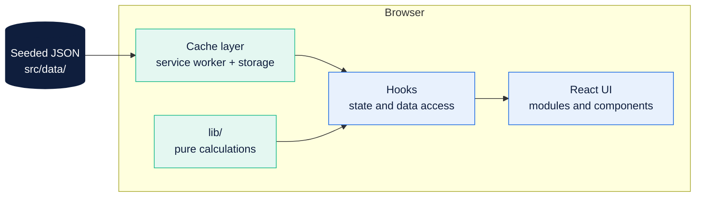

# Architecture

ReFlex is a client-only responsive web application over a seeded data set. There is no backend, no
university API and no database. That is a deliberate scope decision, not a limitation to be worked
around: it removes the project's only hard external dependency, so the prototype cannot be blocked by
an access request the university does not grant.

---

## Shape



Three layers, one direction of dependency:

1. **`src/data/`** holds seeded JSON shaped like the records the real portal displays.
2. **`src/lib/`** holds pure functions. No React, no side effects, no I/O. Given the same input they
   return the same output. Every number the user sees is produced here.
3. **`src/modules/` and `src/components/`** render. They call hooks, which call `lib`. They never
   calculate.

The reason for the split is blunt: the calculations are the part of this product that must be correct,
and a pure function is the only kind of code in this repository that is straightforward to test.

---

## Data model

Seeded records mirror the shapes observed in the live portal, so the prototype reads as real to a test
participant. Every value is invented.

```
student        rollNumber, name, section, batch, campus, programme, contact (masked by default)
semester       id, label, startDate, endDate, registrationWindow, isCurrent
course         code, title, section, creditHours, type, instructorRole
enrolment      studentId, courseId, semesterId, status
lecture        courseId, date, durationHours, present
assessment     courseId, name, weight, maxScore, obtainedScore, publishedAt
gradeRecord    courseId, semesterId, grade, points, statusCode
challan        id, semesterId, amount, generatedOn, dueDate, status, paidOn
request        type, courseIds, state, openFrom, openUntil, submittedAt, decidedAt, attachment
studyPlan      semesterNumber, courses, prerequisites
notification   category, payload, deliveredAt, readAt
```

Two fields carry most of the product's value and both are derived, never stored:

- **Attendance headroom** comes from the lecture list, the total scheduled lectures and
  `ATTENDANCE_THRESHOLD`.
- **Required score for a target grade** comes from the assessment list, its weights and the target.

Neither is written into the seed data. Seeding a derived value would hide a bug in the function that
produces it.

---

## Offline strategy

Offline is a first-class state, not a failure mode.

- A service worker caches the application shell and the last synchronised attendance, marks and
  transcript data.
- Every cached view renders a **sync-age label**. The user always knows how old the number is.
- **Time-sensitive countdowns are suppressed offline.** "Due in 4 days" computed from a stale record is
  worse than no countdown, because the student may act on it. The date is shown; the countdown is not.
- Login is unavailable offline. The cached read is offered instead.
- Cached academic data is cleared on logout. Shared devices are a real pattern in our user base.

---

## State

- **Server-ish state** (the seeded records) is loaded once and held in a context provider.
- **View state** (selected semester, selected course, expanded rows) is local to the component.
- **Persisted preferences** (locale, theme, text size, notification categories, attendance threshold)
  live in `localStorage` behind a `usePreferences` hook, never read directly from components.

No external state management library unless the group agrees the application has outgrown context.

---

## Routing

One route per screen in the 22-screen inventory. Two properties are deliberate and both are load-bearing:

- **The Today dashboard is the only hub.** Every module landing screen is one step from it, which is
  what makes the two-tap target achievable.
- **Notifications and search deep-link into detail screens.** A student who taps an attendance alert
  lands on the attendance detail for that course, not on a list they must search again.

---

## Performance budget

| Metric | Target |
| :--- | :--- |
| First meaningful content | Under 2.5s on simulated 3G, mid-range Android |
| Screens reachable from the dashboard | 2 taps or fewer |
| Offline read availability | At least 7 days after last sync |
| Bundle | Kept small enough to load on metered mobile data; audited before each phase deadline |

Our users are on entry-level and shared Android handsets over intermittent, metered connections. A
heavy bundle is an accessibility problem, not a performance nicety.
